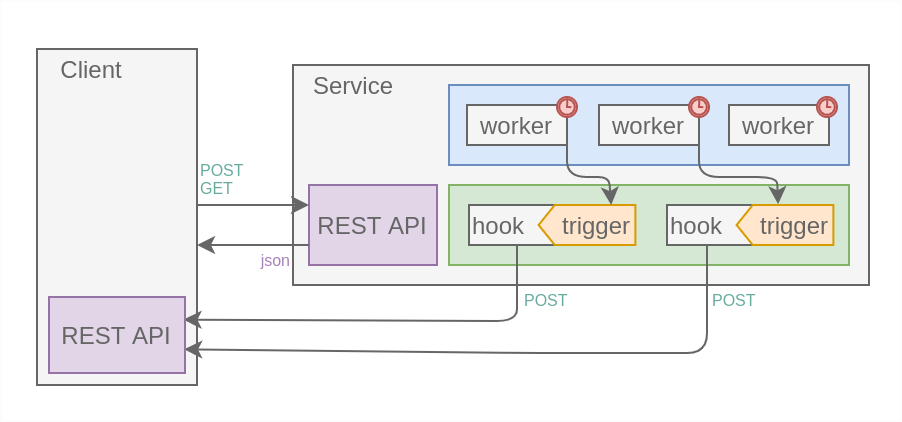

# Go service

### Install: `go get github.com/derv-dice/service`

### Scheme:


### Using example:
```go
package main

import (
	"fmt"
	"log"
	"time"

	"github.com/derv-dice/service"
	"github.com/gocraft/web"
)

func main() {
	mux := web.New(service.ApiContext{})
	mux.Get("/", func(w web.ResponseWriter, r *web.Request) {
		w.Write([]byte("hello from service"))
	})
	mux.Post("/hook_handler", func(w web.ResponseWriter, r *web.Request) {
		fmt.Println("hook received")
	})
	mux.Post("/hook_handler_2", func(w web.ResponseWriter, r *web.Request) {
		fmt.Println("hook 2 received")
	})

	functions := service.NewHookFuncMap()
	functions.Add("fun_1", func() *service.Form {
		fmt.Println("fun_1")
		return nil
	})
	functions.Add("fun_2", func() *service.Form {
		fmt.Println("fun_2")
		return nil
	})

	s, err := service.New(
		"service_name",
		service.Config{
			Addr: "localhost:8080",
			Mux:  mux,
		},
		fmt.Sprintf("postgres://%s:%s@%s:%d/%s", "user", "password", "host", 5432, "db_name"),
		functions,
	)

	if err != nil {
		log.Fatal(err)
	}
	
	s.DeleteHook("hook_1")
	s.DeleteHook("hook_2")
	s.AddHook("hook_1", "fun_1")
	s.AddHook("hook_2", "fun_2")

	s.AddWorker("hook_1_trigger", time.Second*5, func() error {
		s.TriggerHook("hook_1")
		return nil
	})

	s.AddWorker("hook_2_trigger", time.Second*5, func() error {
		s.TriggerHook("hook_2")
		return nil
	})

	go s.Start("", "")
	select {}
}
```